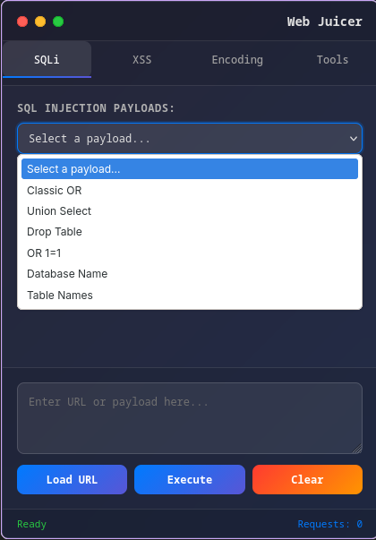
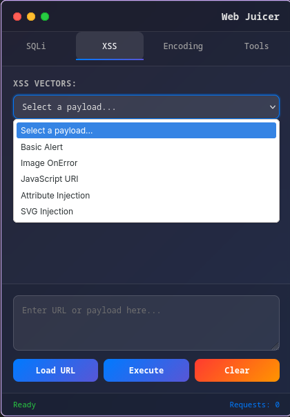
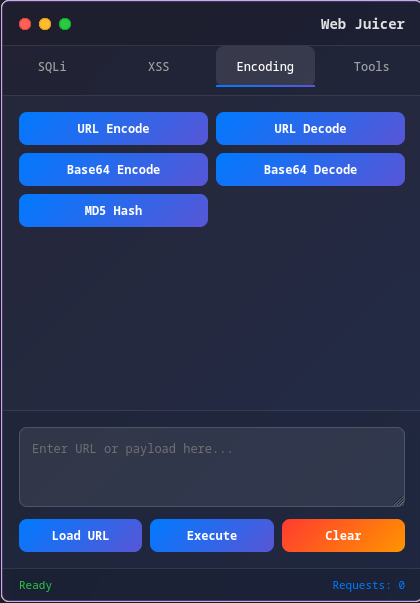
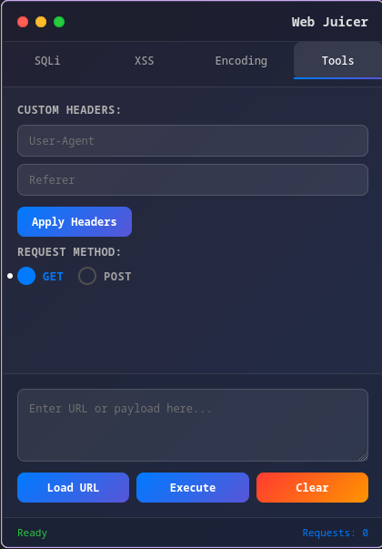

# 🧃 Web Juicer

**Web Juicer** is a sleek, macOS-inspired browser extension designed for web security researchers, bug bounty hunters, and penetration testers. It provides a centralized sidebar to test for common vulnerabilities without breaking your workflow.

  

## 🚀 Features & Interface

### 1. SQL Injection (SQLi)
Access a curated collection of SQL injection payloads including Classic OR, Union Select, and Database/Table enumeration strings.

### 2. XSS Vectors
A library of ready-to-use Cross-Site Scripting strings, including Image OnError, JavaScript URI, and SVG injection methods.

### 3. Live Encoding & Hashing
Instantly convert strings between **URL**, **Base64**, and **MD5** formats for data obfuscation and analysis.

### 4. Advanced Tools & Headers
Modify `User-Agent` and `Referer` headers on the fly and toggle between **GET** and **POST** request methods.

---

## 🛠️ Built With
* **JavaScript (ES6+)** - Core logic and DOM manipulation.
* **CSS3** - Custom styling with a professional dark-mode macOS aesthetic.
* **Manifest V3** - Built for the latest browser extension standards.
* **Node.js / EJS** - Component rendering and backend logic.

## 📦 Installation

### For Firefox (Temporary Load)
1. Clone the repository: `git clone https://github.com/itsdheera2k1//web-juicer.git`
2. Open Firefox and type `about:debugging` in the URL bar.
3. Click **"This Firefox"** -> **"Load Temporary Add-on..."**.
4. Select the `manifest.json` file from the project folder.

### For Chrome / Brave
1. Open your browser and go to `chrome://extensions/`.
2. Enable **"Developer mode"** in the top right.
3. Click **"Load unpacked"** and select the project folder.

## 🖥️ Usage
1. Click the **Web Juicer** icon in your browser toolbar to open the sidebar.
2. Select your target category (**SQLi**, **XSS**, etc.).
3. Choose a payload or enter a custom URL/string.
4. Click **Execute** to inject the payload or **Load URL** to fetch the current tab's address.

---

## ⚖️ Disclaimer
*This tool is for educational and authorized security testing purposes only. The developer is not responsible for any misuse or damage caused by this application. Always obtain permission before testing any web application.*

## 🤝 Contributing
Contributions are welcome! Feel free to submit a Pull Request or open an issue for new payload suggestions.
